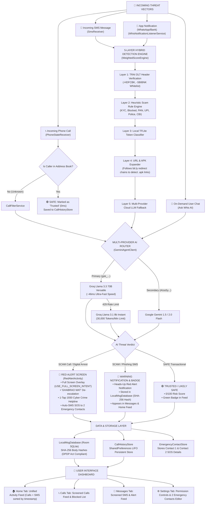

# 🎯 WHIS AI — CORE MISSION, ARCHITECTURE & STRATEGY (CORE.md)

---

## 1. THE CORE AIM

The core aim of **Whis AI** is to protect India's next **300 million first-time digital banking users** in Tier-2, Tier-3, and rural areas from devastating financial losses and psychological harassment caused by cyber fraud.

### Core Mission Objectives:
- **Prevent Financial Extortion**: Stop "Digital Arrest" impersonation calls from fake Police, CBI, or Customs officers before the victim engages.
- **Neutralize Phishing & Malware**: Automatically detect fake bank KYC update links, electricity bill disconnection traps, and malicious loan app `.apk` downloads in SMS and notifications.
- **Eliminate UPI Misconceptions**: Enforce the universal rule: *"UPI PIN is ONLY for SENDING money, NEVER for RECEIVING."*
- **De-Escalate Psychological Panic**: Provide clear, colloquial Hinglish guidance (*"GHABRAO MAT"*) and instantly bridge victims to India's **1930 Cyber Crime Helpline** and their family.

---

## 2. HOW WE ACHIEVE THE AIM

Whis AI achieves its mission through a non-intrusive, hybrid, privacy-first mobile architecture:

1. **Pre-Emptive Screen Interruption**: Instead of logging scams after the loss occurs, Whis screens incoming callers in **~46ms** using Groq Llama 3.3 70B AI. If a Digital Arrest threat is detected, Whis interrupts the user's screen with a full-screen `RedAlertActivity` before the call is answered.
2. **5-Layer Hybrid Detection Pipeline**: Combines zero-latency local checks (DLT header whitelisting, keyword rules, on-device ML, URL expansion) with ultra-fast cloud LLM reasoning. Messages escalate to cloud AI only when local layers are inconclusive, preserving speed and privacy.
3. **Automated Family Emergency SOS Network**: Dispatches automated emergency SMS alerts to **2 Emergency Contacts** configured by the user, creating an immediate family safety net.
4. **DPDP Act 2023 Compliance**: Converts SMS message bodies into **SHA-256 hashes** before storing them in local SQLite databases, guaranteeing zero plaintext message persistence.

---

## 3. STRATEGIC EXECUTION PLAN

```
[Phase 1: Interception] ──► [Phase 2: Hybrid Detection] ──► [Phase 3: AI Intent Reasoning] ──► [Phase 4: Action & Intervention]
```

- **Phase 1 (Interception)**: Intercept incoming voice calls via `PhoneStateReceiver` and SMS/App notifications via `WhisNotificationListenerService`.
- **Phase 2 (Hybrid Detection)**: Run local DLT whitelisting (Layer 1), keyword scam taxonomy matching (Layer 2), on-device TFLite classification (Layer 3), and `UrlExpander` link analysis (Layer 4).
- **Phase 3 (AI Intent Reasoning)**: Dispatch ambiguous payloads to **Groq Llama 3.3 70B** (`gsk_...`) for sub-second semantic analysis, with automatic failover to **Groq 8B (30k TPM)** or **Google Gemini Flash**.
- **Phase 4 (Action & Intervention)**: Trigger `RedAlertActivity` full-screen overlay for scam calls, post heads-up warning notifications for phishing SMS, update the Room database, and alert **2 Emergency Contacts**.

---

## 4. WHAT IS THE MIND MAP (SYSTEM VISUALIZATION)



---

## 5. WHICH FEATURES ARE USED AND HOW THEY HELP

| Feature Name | Technical Implementation | How It Helps the User |
| :--- | :--- | :--- |
| **0ms Known Contact Fast-Pass** | `PhoneStateReceiver` + `ContactsContract` check | **0ms latency, 100% privacy**. Saved family/friends are instantly marked as `Trusted`, eliminating false alarms and keeping private contact data on-device. |
| **Full-Screen Red Alert ("GHABRAO MAT")** | `RedAlertActivity` (`USE_FULL_SCREEN_INTENT`, `showWhenLocked`) | **Breaks panic during extortion calls**. Opens over lockscreen with "GHABRAO MAT", legal facts (*"Real police never arrest over video call"*), and clear emergency buttons. |
| **1-Tap 1930 Cyber Helpline Bridge** | `Intent.ACTION_DIAL` (`tel:1930`) | **Instant Government Reporting**. Allows victims to connect directly to India's National Cyber Crime Helpline in 1 tap without searching for numbers. |
| **2 Emergency Contacts (SOS)** | `EmergencyContactStore` + `EmergencyContactNotifier` | **Automatic Family Protection**. Dispatches emergency SOS SMS messages to **2 saved family members/friends** during active scam threats. |
| **5-Layer Hybrid Detection Engine** | `WeightedScoreEngine` (Layers 1–5) | **Comprehensive Multi-Vector Defense**. Screens headers, scam keywords, ML tokens, suspicious URLs, and cloud AI context for unmatched accuracy. |
| **URL & APK Expander** | `UrlExpander` (Redirect chain tracker) | **Blocks Loan App Malware**. Unmasks shortened links (`bit.ly`) and flags deceptive domains (`.xyz`, `.top`) and terminal `.apk` loan app downloads. |
| **System Utility Filter** | `WhisNotificationListenerService` package filter | **Zero False Alarms**. Excludes system packages (`smartcapture`, `screenshot`, `systemui`, `dialer`) while screening real WhatsApp/Banking notifications. |
| **Multi-Provider AI Router** | `GeminiAgentClient` (Groq Llama 3.3 70B & Gemini) | **Sub-Second Intelligence (~46ms)**. Evaluates complex scam messages with automatic 429 rate limit failover to 8B models (30,000 TPM limit). |
| **Hinglish Security Persona** | `SystemPromptBuilder` locale configuration | **No Complex Jargon**. Communicates in colloquial Hinglish (*"Yeh nakli bank link hai. Ispe click mat karo."*) matching spoken rural language. |
| **Hardcoded UPI PIN Rule** | System prompt & response constraint | **Prevents #1 UPI Fraud**. Teaches and enforces: *"UPI PIN is ONLY for SENDING money, NEVER for RECEIVING."* |
| **DPDP Act SHA-256 Storage** | Room SQLite (`LocalMsgDatabase`) hash indexing | **Complete Data Privacy**. Stores SHA-256 message hashes rather than raw body text, ensuring Whis never acts as a surveillance tool. |
| **Direct System Settings Intents** | `Settings.ACTION_NOTIFICATION_LISTENER_SETTINGS` | **Seamless Permission Setup**. Provides direct 1-tap buttons in Settings to enable Notification Access and Do Not Disturb (DND) Override. |

---

## 6. KEY DIFFERENTIATORS

- **Non-Intrusive Background Operation**: Whis does **not** demand becoming the default SMS handler, lowering adoption friction.
- **Resilient AI Architecture**: Dual Groq/Gemini routing eliminates single-point-of-failure rate limit crashes.
- **Interactive Cyber Education**: Includes the **Learn Tab** (`LearnRepository`) with interactive scam chapters (Digital Arrest, Phishing, UPI Rules, APK Malware) and RBI Zero-Liability refund guidelines.

---

## 7. EXECUTIVE SUMMARY

**Whis AI** is a complete, production-grade Android application (`targetSdk 36`, `minSdk 24`) that combines ultra-fast AI intelligence, privacy-first local hashing, full-screen emergency de-escalation, and dual-contact SOS alerts. It provides the next 300 million digital banking citizens of India with an unbreachable, non-intrusive cyber safety shield.

- **Repository**: [https://github.com/govind-ma/whis-ai](https://github.com/govind-ma/whis-ai)
- **License**: MIT License
