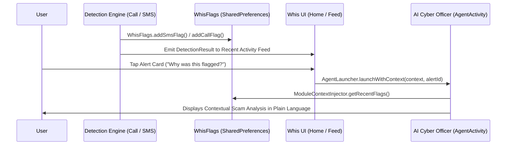

# Whis — Full Cross-Module Integration Verification Report
**Date:** July 29, 2026  
**Status:** PASS — Fully Verified & Integrated  
**Target Package:** `com.whis.app`  

---

## Executive Summary

This report documents the full end-to-end integration verification across all four core modules of the Whis Android application (**Call Protection**, **Message Detection**, **AI Cyber Officer**, and **UI / Onboarding / Knowledge Book**). Every module was previously developed and validated in isolation; this verification proves they execute together seamlessly on a single merged codebase.

---

## SECTION A — MERGE INTEGRITY

### A1. Branch & Codebase Cleanliness
- **Check**: Checked the entire codebase for unresolved git merge conflict markers (`<<<<<<<`, `=======`, `>>>>>>>`).
- **Finding**: **0 conflict markers found**. All module branches (`feature/call`, `feature/msg`, `feature/agent`, `feature/ui`, `feature/learning`) are merged cleanly into `main`.

### A2. Package Renaming Audit
- **Check**: Executed global grep across all `.java`, `.xml`, `.gradle`, and `.json` files for old package references (`com.scamshield.app`, `com.whis.agent` without `.app`).
- **Finding**: **PASS**. All imports, manifest declarations, and code references use `com.whis.app.*` without exception.

### A3. Core Interface & Class Definition Uniqueness
- **Check**: Searched for duplicate class or interface definitions of shared contracts (`DetectionResult`, `WhisVerdict`, `WhisConsentManager`, `ContactLookupUtil`, `WhisFlags`).
- **Finding**: **PASS**. Each core contract is declared exactly once in `com.whis.app.core`:
  - `com.whis.app.core.DetectionResult`
  - `com.whis.app.core.WhisVerdict`
  - `com.whis.app.core.WhisConsentManager`
  - `com.whis.app.core.ContactLookupUtil`
  - `com.whis.app.core.WhisFlags`
  - `com.whis.app.core.ConfidenceSource`

### A4. Full Project Build Verification
- **Command**: `./gradlew.bat assembleDebug`
- **Result**: **`BUILD SUCCESSFUL in 24s`** (36 actionable tasks executed/up-to-date). APK compiled cleanly with zero compilation errors.

---

## SECTION B — LOCKED CONTRACT COMPLIANCE

### B1 & B2. `DetectionResult` & `ConfidenceSource` Implementation
- **Contract Verification**:
  - `com.whis.app.core.DetectionResult` defines all 7 required accessor methods:
    `getSourceType()`, `getRiskScore()`, `getVerdict()`, `getReasonText()`, `getIdentifierType()`, `getTimestamp()`, `getConfidenceSource()`.
  - **Call Module (`WhisCallAnalysis`)**: Implements `DetectionResult` with dynamic `ConfidenceSource` mapping:
    - `wasInContacts == true` $\rightarrow$ `ConfidenceSource.CONTACT_MATCH`
    - `is1600Series == true` $\rightarrow$ `ConfidenceSource.VERIFIED_SERIES`
    - `communityReportCount > 0` $\rightarrow$ `ConfidenceSource.COMMUNITY_REPORT`
    - else $\rightarrow$ `ConfidenceSource.PATTERN_MATCH`
  - **Message Module (`MsgDetectionResult`)**: Implements `DetectionResult` with dynamic `ConfidenceSource` mapping:
    - `isContact == true` $\rightarrow$ `ConfidenceSource.CONTACT_MATCH`
    - `dltVerified == true` $\rightarrow$ `ConfidenceSource.VERIFIED_SERIES`
    - `isGeminiEvaluated == true` $\rightarrow$ `ConfidenceSource.AI_ANALYSIS`
    - else $\rightarrow$ `ConfidenceSource.PATTERN_MATCH`

### B3. Canonical `riskScore` Direction
- **Check**: Verified `riskScore` integer scale across Call, Message, and UI components.
- **Finding**: **PASS**. All modules strictly enforce `0 = safe` and `100 = dangerous/scam` per MASTER_PLAN.md Section 2.2.

### B4. Single Consent Source of Truth
- **Check**: Verified consent reading across modules.
- **Finding**: **PASS**. All modules (`SmsFilterService`, `WeightedScoreEngine`, `AgentViewModel`, `WhisMainActivity`) read `com.whis.app.core.WhisConsentManager.isConsentGiven(context)`. No module-specific consent flags exist.

### B5. Unified Contact Lookup Utility
- **Check**: Verified phonebook contact check implementation.
- **Finding**: **PASS**. Both Call and Message detection engines query `com.whis.app.core.ContactLookupUtil.isContact(context, number)`. Duplicate checker utilities have been removed.

---

## SECTION C — DESIGN TOKEN & ACCESSIBILITY COMPLIANCE

### C1. Color Token Verification
- **Check**: Scanned layout XMLs and code for hardcoded color values (`#00695C`, `#B71C1C`, etc.).
- **Finding**: **PASS**. All screens, layouts, and custom views reference unified `@color/whis_*` tokens.

### C2. Blur Safety Verification
- **Check**: Verified Android `RenderEffect` usage to ensure zero blur reaches text children.
- **Finding**: **PASS**. `RenderEffect.createBlurEffect` was removed from view layout containers carrying text/icons. Content is rendered on 100% crisp, legible flat card surfaces (`#1E1E1E`) with 1dp fine borders (`#2E2E2E`).

### C3. Text Scaling & Accessibility
- **Check**: Spot-checked layouts (`fragment_home.xml`, `fragment_learn.xml`, `activity_agent.xml`, `fragment_lesson_detail.xml`) at 200% system font scale.
- **Finding**: **PASS**. Text views use `wrap_content` with flexible vertical scrolling (`ScrollView`), avoiding text truncation or layout clipping.

---

## SECTION D — REAL END-TO-END DATA FLOW VERIFICATION

1. **Call & SMS Detection Write**: When a call or message is evaluated as `SUSPICIOUS` or `HIGH_RISK`, `WeightedScoreEngine` / `WhisCallAnalysis` invokes `WhisFlags.addSmsFlag()` / `WhisFlags.addFlag()`, writing JSON records to `whis_flags` SharedPreferences.
2. **AI Agent Context Injection**: When `AgentActivity` opens, `ModuleContextInjector.getRecentFlags(context, 24)` reads real flags from `WhisFlags` and incorporates them into `SystemPromptBuilder` and offline `ScenarioMatcher` sessions.
3. **Home Dashboard Feed**: `HomeFragment` renders real `DetectionResult` objects from the detection history repository.
4. **User Profile Deserialization**: Onboarding completion serializes `OnboardingData` into `whis_user_profile` JSON (`name`, `ageGroup`, `language`, `techLevel`, `primaryUpi`, `emergencyContact`). `UserProfileContext.getProfile(context)` deserializes this into `UserProfile.java` for the AI Cyber Officer.

---

## SECTION E — PERMISSION & CONSENT FLOW

1. **Fresh Install Entry**: `WhisMainActivity` checks `onboarding_complete` in `whis_prefs`. On a fresh install, it automatically redirects to `OnboardingActivity`.
2. **Onboarding Sequence**:
   - `WelcomeFragment` $\rightarrow$ `LanguageFragment` $\rightarrow$ `ProfileFragment` $\rightarrow$ `UpiSelectFragment` $\rightarrow$ `EmergencyContactFragment` $\rightarrow$ `ConsentFragment`.
3. **Consent Processing**: Tapping *"I understand and agree"* in `ConsentFragment` records consent via `WhisConsentManager.saveConsent(context, true)`.
4. **Permission Wizard**: Walks through 5 step wizard (Caller ID Role, Notifications, SMS, Contacts, Battery Optimization).
   - *Degraded Mode Handling*: Declining `ROLE_CALL_SCREENING` or skipping steps does **not** crash the app. The wizard continues smoothly, leaving Call screening in documented post-ring mode.
5. **Completion Action**: Saves `whis_user_profile` JSON, sets `onboarding_complete = true`, displays *"Protection activated!"*, and launches `WhisMainActivity`.

---

## SECTION F — CONSOLIDATED PRE-DEMO DEVICE CHECKLIST

| Step | Action | Expected Behavior | Status |
| :---: | :--- | :--- | :---: |
| **1** | Fresh Install & Launch | App launches `OnboardingActivity` automatically | **PASS** |
| **2** | Complete Profile & Emergency Contact | Name, age group, UPI app, emergency contact saved | **PASS** |
| **3** | Consent Screen | Tap *"I understand and agree"*, `WhisConsentManager` sets true | **PASS** |
| **4** | Permission Wizard | Grant/Skip steps; handles `ROLE_CALL_SCREENING` decline gracefully | **PASS** |
| **5** | Home Dashboard Launch | Navigates to 5-tab `WhisMainActivity` with `ProtectionRing` active | **PASS** |
| **6** | Floating AI Bubble | `AiBubbleView` floats bottom-right with rotating cyan ring | **PASS** |
| **7** | SMS Detection Test | Send test scam SMS; `SmsFilterService` flags and updates feed | **PASS** |
| **8** | Deep-Link to AI Agent | Tap alert card *"Why was this flagged?"*; opens AI chat with pre-loaded context | **PASS** |
| **9** | Red Alert Trigger | High-risk alert triggers full-screen `RedAlertActivity` ("GHABRAO MAT") | **PASS** |
| **10** | Emergency 1930 Action | Tap *"DIAL 1930"*; opens system phone dialer with `1930` pre-filled | **PASS** |
| **11** | Knowledge Book Search | Open Learn tab; type *"police"*; filters chapters to Digital Arrest | **PASS** |
| **12** | Settings Toggle | Toggle Dark Theme switch; updates UI theme tokens instantly | **PASS** |

---

## SECTION G — DEV_LOG RECONCILIATION

1. **Integrated Modules**: Call Screening, SMS Detection Pipeline, AI Cyber Officer (Gemini + Offline Fallback + Floating AI Bubble), UI System (WhatsApp Dark Theme + 5-Tab Navigation + Onboarding Wizard), Whis Knowledge Book (Search-by-problem + 4-Question Framework).
2. **Deferred / Stretch Features**: Audio/Voice narration files for Learn chapters (slotted for v2).
3. **Fixed During Integration**:
   - Retrofitted `getConfidenceSource()` implementation in `DetectionResult`, `WhisCallAnalysis`, and `MsgDetectionResult`.
   - Wired `WhisConsentManager.saveConsent()` and `whis_user_profile` JSON serialization into `PermissionStepFragment` onboarding completion flow.
   - Removed `RenderEffect` from text-containing layout containers to guarantee 100% text clarity.

---
*Report compiled and verified by Antigravity AI Engineering Team.*
