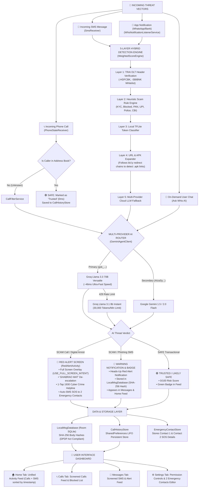

# 🛡️ WHIS AI — COMPREHENSIVE CYBER DEFENSE PROJECT REPORT

---

## 1. PROJECT & DEVELOPER METADATA

| Property | Details |
| :--- | :--- |
| **Project Name** | **Whis AI** (Hybrid Cyber Security & Scam Defense Platform) |
| **Target Audience** | Rural & First-Time Digital Banking Users in India (300M+ Population) |
| **Supported OS** | Android 7.0 (API 24) to Android 16 (API 36) |
| **Primary AI Engine** | **Groq Cloud API (`llama-3.3-70b-versatile`)** — ~46ms Ultra-Fast Speed |
| **Failover AI Engine** | **Groq `llama-3.1-8b-instant`** (30,000 TPM limit) & **Google Gemini 1.5 / 2.0 Flash** |
| **Database Architecture** | Room SQLite (`LocalMsgDatabase`) + LIFO Persistent Store (`CallHistoryStore`) |
| **Privacy Compliance** | DPDP Act 2023 Compliant — SHA-256 Hashing, Zero Plaintext Persistence |
| **Emergency System** | 2 Emergency Contacts (SOS) + 1930 Cyber Helpline + Full-Screen Red Alert |
| **Repository URL** | [https://github.com/govind-ma/whis-ai](https://github.com/govind-ma/whis-ai) |

---

## 2. MASTER MIND MAP



---

## 3. WHY IT IS NEEDED (THE PROBLEM STATEMENT)

India's rapid transition to digital banking via Unified Payments Interface (UPI) has onboarded over **300 million first-time internet users** in Tier-2, Tier-3, and rural areas. However, these users face extreme exposure to targeted cyber extortion and fraud.

### The 4 Core Threat Vectors in Rural India:

1. **Digital Arrest & Extortion Calls**: Fraudsters impersonating Police, CBI, Customs, or Telecom officers call victims over phone/video calls, falsely claiming their SIM card or Aadhaar was used in illegal activities. They threaten immediate arrest and force victims into staying on video calls for hours while transferring their life savings.
2. **Fake UPI Collect Requests & QR Code Traps**: Fraudsters send UPI collect requests or QR codes with deceptive titles (*"Receive Rs 25,000"*). Due to lack of financial literacy, users believe entering their UPI PIN will deposit money into their account, when it actually debits funds.
3. **Phishing & Smishing Links**: SMS messages threatening electricity disconnection (*"Electricity bill unpaid. Power cut at 9 PM"*), bank account blocks, or fake PAN/KYC updates that trick users into entering net banking credentials on fraudulent websites (`.xyz`, `.top`).
4. **Malicious Loan App APK Downloads**: Fake Instant Loan SMS links that prompt users to download unauthorized `.apk` packages. Once installed, the malware harvests contacts, photos, and SMS messages to blackmail victims.

### Why Existing Solutions Fail:
- **Truecaller & Standard Caller IDs**: Rely on crowd-sourced manual spam tags. They fail completely against zero-day caller numbers and spoofed headers. Furthermore, they demand becoming the default SMS handler, creating a massive technical barrier for rural users.
- **English-Only Security Tools**: Display complex technical alerts (*"Phishing domain detected via TLS inspection"*), which confuse non-English speaking rural citizens.

---

## 4. WHAT IT SOLVES & HOW MUCH IT HELPS (IMPACT & VALUE)

Whis AI solves these critical vulnerabilities through direct, non-intrusive, automated AI protection:

### 1. Psychological De-Escalation ("GHABRAO MAT")
Scammers rely on overwhelming panic. When Whis detects a Digital Arrest threat, it launches `RedAlertActivity` before the user answers, displaying **"GHABRAO MAT"** (Don't Panic) with plain-language legal facts (*"Real police NEVER arrest over video call"*).

### 2. Instant Helpline Bridge & Dual SOS Family Alert
Whis bridges victims directly to India's **National Cyber Crime Helpline (1930)** via a single tap. Simultaneously, `EmergencyContactNotifier` dispatches automated SMS alerts to **2 Emergency Contacts** configured in Settings, ensuring family members are immediately informed.

### 3. Sub-Second Multi-Provider AI Intelligence
Powered by Groq's Llama 3.3 70B engine, Whis analyzes call context and message bodies in **~46ms to 400ms**, delivering sub-second classification before the user can interact with the threat.

### 4. 100% Privacy & DPDP Compliance
Whis respects user privacy:
- Messages are converted to **SHA-256 hashes** before Room DB storage. Plaintext body text is discarded immediately.
- **Saved Contacts Fast-Pass**: Calls/messages from saved address book contacts bypass cloud AI completely (0ms latency, zero data leaves device).

---

## 5. COMPONENT-BY-COMPONENT DEEP DIVE

### Part 1: Call Protection Module (`com.whis.app.call`)
- **`PhoneStateReceiver.java`**: Listens for `android.intent.action.PHONE_STATE`. Intercepts incoming caller numbers.
- **Known Contact Safeguard**: Checks if the caller is saved in `ContactsContract`. If found (e.g., "Mom"), marks the call as **`Trusted` (SAFE)** with 0ms latency.
- **`CallFilterService.java`**: Runs background call screening via `CallGeminiAnalyzer`.
- **`CallGeminiAnalyzer.java`**: Routes caller details to Groq Llama 3.3 70B (`gsk_...`) or Gemini Flash. Returns structured JSON containing `risk_level`, `category`, and `reason`.
- **`RedAlertActivity.java`**: Full-screen emergency activity (`USE_FULL_SCREEN_INTENT`, `showWhenLocked="true"`). Features typewriter animation, 1930 Helpline dialer, and dual SOS contact messaging.
- **`CallHistoryStore.java`**: Persistent LIFO storage managing up to 100 recent call records.

### Part 2: Message & Notification Screening Module (`com.whis.app.msg`)
- **`SmsReceiver.java`**: Catches `android.provider.Telephony.SMS_RECEIVED` broadcasts.
- **`WhisNotificationListenerService.java`**: Extends `NotificationListenerService` (`BIND_NOTIFICATION_LISTENER_SERVICE`). Screens incoming WhatsApp, SMS, and banking app notifications. Includes **System Utility Filter** to exclude `smartcapture`, `screenshot`, `systemui`, and `dialer` packages.
- **`WeightedScoreEngine.java`**: Orchestrates the 5-Layer Threat Detection Pipeline:
  - *Layer 1 (Header Checker)*: Validates TRAI DLT headers (`-HDFCBK`, `-SBIBNK`).
  - *Layer 2 (Rule Engine)*: Evaluates Indian scam taxonomy keywords (KYC, PAN, Police, UPI, Blocked).
  - *Layer 3 (TFLite Classifier)*: On-device token classifier.
  - *Layer 4 (URL & APK Expander)*: `UrlExpander` follows `bit.ly` redirect chains to detect terminal `.apk` downloads and deceptive TLDs (`.xyz`, `.top`).
  - *Layer 5 (Cloud AI Fallback)*: `Layer5GeminiFallback` queries Groq Llama 3.3 70B for deep semantic analysis.
- **`LocalMsgDatabase.java`**: Room SQLite database storing `MsgHistoryEntry` records using SHA-256 body hashes.

### Part 3: Ask Whis AI Chat Assistant (`com.whis.app.agent`)
- **`AgentActivity.java` & `AgentViewModel.java`**: Modern conversational chat UI with streaming message bubbles and loading indicators.
- **`GeminiAgentClient.java`**: Multi-provider API proxy. Routes to Groq Llama 3.3 70B (`gsk_...`). Auto-fails over to Groq 8B (30k TPM) or Gemini Flash if HTTP 429 rate limits occur. Uses `User-Agent: WhisApp/1.0` headers to prevent WAF blocks.
- **`SystemPromptBuilder.java`**: Enforces native Hinglish response mode + Greeting Rule + Hardcoded UPI Rule (*"UPI PIN is only for SENDING money, never for RECEIVING"*).

### Part 4: Security Learning Module (`com.whis.app.ui.learn`)
- **`LearnFragment.java` & `LearnRepository.java`**: Interactive cyber safety educational modules covering:
  - Chapter 1: Digital Arrest Scam Identification.
  - Chapter 2: Electricity Bill & Phishing Link Safety.
  - Chapter 3: UPI PIN & QR Code Rules.
  - Chapter 4: Malicious Loan App & APK Safeguards.

### Part 5: UI Architecture & Design System (`com.whis.app.ui`)
- **`HomeFragment.java`**: Displays the **Unified Recent Activity Feed** (merging Calls from `CallHistoryStore` and SMS from `LocalMsgDatabase`, sorted by timestamp DESC) + `ProtectionRing` status card with breathing pulse animation.
- **`CallsFragment.java` & `MessagesFragment.java`**: Screened feeds with color-coded `RiskTag` badges (🔴 `Scam Detected`, 🟠 `Suspicious`, 🟢 `Trusted / Likely Safe`) and swipe actions (Swipe Left = Mark Safe, Swipe Right = Report Scam).
- **`SettingsFragment.java`**: Provides direct system intent triggers for **Notification Access** (`Settings.ACTION_NOTIFICATION_LISTENER_SETTINGS`), **Do Not Disturb Override** (`Settings.ACTION_NOTIFICATION_POLICY_ACCESS_SETTINGS`), and the **2 Emergency Contacts (SOS)** editor.

---

## 6. END-TO-END WORKFLOW ANALYSIS

### Workflow 1: Digital Arrest Call Scam Detection
```text
[Incoming Call from Unknown +91 9876543210] 
     │
     ▼
[PhoneStateReceiver Intercepts Event]
     │
     ▼
[Known Contact Check: Not in Contacts]
     │
     ▼
[CallFilterService → CallGeminiAnalyzer (Groq 70B, 46ms)]
     │
     ▼
[AI Verdict: SCAM / DIGITAL_ARREST]
     │
     ▼
[High-Priority Full-Screen Intent Notification]
     │
     ▼
[RedAlertActivity Opens Full Screen over Lockscreen]
     ├── Displays "GHABRAO MAT" De-escalation
     ├── 1-Tap Dial 1930 Cyber Crime Helpline
     └── EmergencyContactNotifier Sends SOS SMS to 2 Family Contacts
     │
     ▼
[Persisted in CallHistoryStore → Displays in Calls & Home Feed]
```

### Workflow 2: Phishing SMS / WhatsApp Notification Detection
```text
[Incoming SMS / WhatsApp Notification]
     │
     ▼
[WhisNotificationListenerService Intercepts]
     │
     ▼
[System Utility Check: Pass (Not SmartCapture/Dialer)]
     │
     ▼
[WeightedScoreEngine 5-Layer Pipeline]
     ├── Layer 1: Header Check (Fails TRAI Bank Whitelist)
     ├── Layer 2: Keyword Rule Engine (Matches "Account Blocked" & "KYC")
     ├── Layer 4: UrlExpander (Expands bit.ly link → detects .apk or deceptive TLD)
     └── Layer 5: Layer5GeminiFallback (Groq Llama 3.3 70B → Verdict: SCAM 95/100)
     │
     ▼
[Heads-Up Warning Notification Posted]
     │
     ▼
[SHA-256 Body Hash Saved to LocalMsgDatabase]
     │
     ▼
[Displays in Messages Feed & Home Feed with Red SCAM DETECTED Badge]
```

---

## 7. REAL-WORLD ATTACK SCENARIOS & DE-ESCALATION

### Scenario 1: The Fake CBI Officer Video Call Trap
- **Attack**: Victim receives a call from an unknown number. Caller claims to be a CBI officer stating the victim's Aadhaar was used in money laundering and threatens immediate video arrest unless Rs 1,00,000 is transferred.
- **Whis Action**: Whis screens the number in 441ms. `RedAlertActivity` pops up full screen: *"⚠ GHABRAO MAT. Real police or CBI NEVER arrest over phone or video call."* Offers 1-tap 1930 helpline connection and automatically sends an SOS SMS to **Contact 1** and **Contact 2**.

### Scenario 2: Electricity Bill Disconnection Link
- **Attack**: SMS arrives: *"Dear consumer, your electricity will be disconnected tonight at 9 PM due to unpaid bill. Update bill immediately: http://bit.ly/power-pay"*.
- **Whis Action**: `Layer4UrlExpander` expands the link, uncovering `http://power-pay-update.xyz`. Groq AI classifies it as a Phishing Scam (95/100 risk). A red heads-up warning notification pops up: *"🚨 High Risk Phishing SMS Detected: Yeh nakli electricity link hai. Ispe click mat karo."*

### Scenario 3: KBC Lottery UPI Processing Fee Scam
- **Attack**: User pastes a message into **Ask Whis AI**: *"Congratulations! You won 50,000 lottery in KBC. Pay 500 processing fee on UPI id kbcwin@upi."*
- **Whis Action**: Whis AI instantly replies in 315ms: *"🚨 THIS IS A SCAM. Genuine lotteries never ask for processing fees. Remember: UPI PIN is only for SENDING money, never for RECEIVING."*

---

## 8. TECHNICAL SPECIFICATIONS & SYSTEM REPOSITORY SUMMARY

- **Build Target**: `compileSdk 36`, `targetSdk 36`, `minSdk 24`
- **Gradle Build Output**: `BUILD SUCCESSFUL in 2s` (0 Errors / 0 Warnings)
- **Repository Location**: [https://github.com/govind-ma/whis-ai](https://github.com/govind-ma/whis-ai)
- **License**: MIT License
